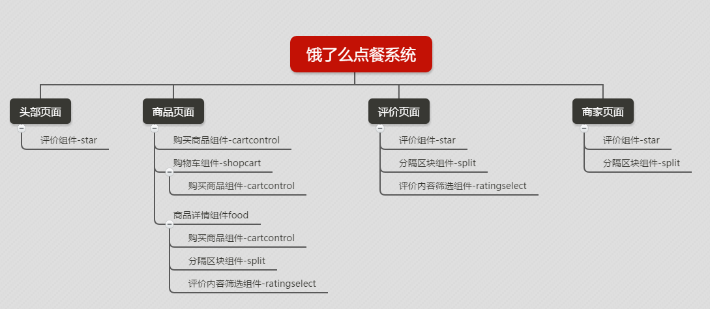
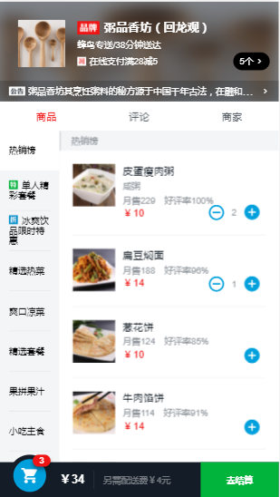
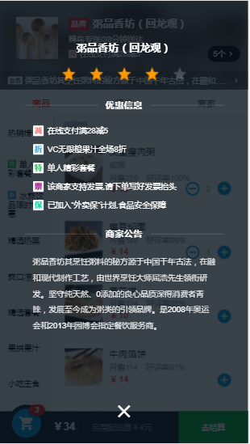
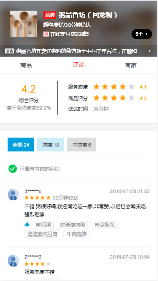
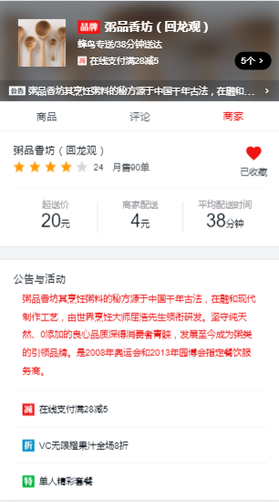

## 仿饿了么点餐系统
### 项目演示
#### 浏览器直接打开
[直接点击运行](https://liaozeen.github.io/ele_sell/#/goods)（请在手机模式下预览）
#### 手机演示

### 页面与组件关系

### 使用的工具和库
- webpack
- eslint
- vue2.0
- vue-router
- vue-resource
- better-scroll

### 项目效果
&nbsp;&nbsp;&nbsp;&nbsp;
&nbsp;&nbsp;&nbsp;&nbsp;
